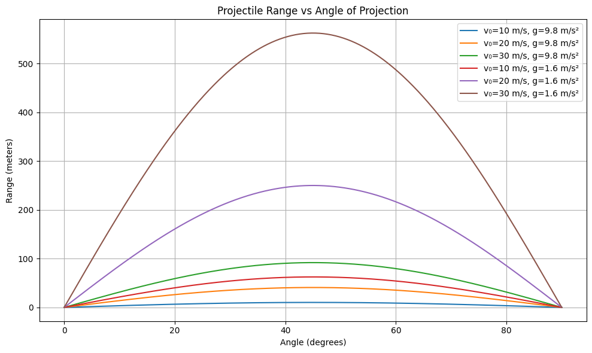

# Problem 1

# 1. Theoretical Foundation

## Governing Equations of Motion  salam

Projectile motion can be understood by analyzing the two-dimensional motion of an object under the influence of gravity (assuming air resistance is negligible). The motion splits into horizontal (x) and vertical (y) components. Let’s derive the equations step by step:

---

### a. Assumptions & Setup

- **Initial velocity**: $\vec{v}_0$  
- **Angle of projection**:  $\theta$  
- **Gravity**:  $g$ (acting downward)  
- **Initial position**:  $(x_0, y_0)$
- **Neglecting air resistance**

Initial velocity components:  
$$
v_{0x} = v_0 \cos \theta, \quad v_{0y} = v_0 \sin \theta
$$

---

### b. Equations of Motion (Derived from Newton's Second Law)

#### Horizontal motion (no acceleration):
$$
\frac{d^2x}{dt^2} = 0 \Rightarrow \frac{dx}{dt} = v_{0x} \Rightarrow x(t) = x_0 + v_0 \cos \theta \cdot t
$$

#### Vertical motion (constant acceleration $-g$):
$$
\frac{d^2y}{dt^2} = -g \Rightarrow \frac{dy}{dt} = v_{0y} - g t \Rightarrow y(t) = y_0 + v_0 \sin \theta \cdot t - \frac{1}{2} g t^2
$$

---

### c. Family of Solutions from Varying Initial Conditions

The general solution describes the path (trajectory) of the projectile:

$$
\begin{cases}
x(t) = x_0 + v_0 \cos \theta \cdot t \\
y(t) = y_0 + v_0 \sin \theta \cdot t - \frac{1}{2} g t^2
\end{cases}
$$

By adjusting **initial conditions**, we generate a **family of parabolic curves**:

- Changing $\theta: affects symmetry and range.
- Changing $v_0$: affects height and distance.
- Changing $y_0$: allows launches from different altitudes.
- Gravity $g$: varies across planets (or in simulations), altering the trajectory.

Each set of parameters yields a unique solution curve — this richness is what makes projectile motion a powerful educational tool in physics.

# 2. Analysis of the Range

## Horizontal Range and Angle of Projection

The **horizontal range** $R$ of a projectile is the horizontal distance it travels before returning to the same vertical level from which it was launched (i.e., when $y = y_0$).

For a projectile launched from ground level ($y_0 = 0$), the total time of flight $T$ is given by:

$$
T = \frac{2 v_0 \sin \theta}{g}
$$

The horizontal range is then:

$$
R = v_0 \cos \theta \cdot T = v_0 \cos \theta \cdot \frac{2 v_0 \sin \theta}{g}
$$

Simplifying:

$$
R = \frac{v_0^2 \sin(2\theta)}{g}
$$

This formula shows a clear dependency on the **angle of projection**:

- The range is **maximum** when $\sin(2\theta) = 1$, which occurs at $2\theta = 90^\circ \Rightarrow \theta = 45^\circ$.
- The function $\sin(2\theta)$ is symmetric about $\theta = 45^\circ$, meaning:
  - $R(30^\circ) = R(60^\circ)$
  - $R(10^\circ) = R(80^\circ)$, etc.

---

## Influence of Other Parameters

### 1. **Initial Velocity $v_0$**

From the range equation:

$$
R = \frac{v_0^2 \sin(2\theta)}{g}
$$

- The range increases **quadratically** with $v_0$.
- Doubling the velocity **quadruples** the range.
- Higher velocity = longer flight time and faster horizontal travel.

### 2. **Gravitational Acceleration $g$**

- The range is **inversely proportional** to $g$.
- On planets with weaker gravity (e.g., the Moon), the same projectile would travel much farther.
- Example:
  - On Earth: $g \approx 9.8\, \text{m/s}^2$
  - On Moon: $g \approx 1.6\, \text{m/s}^2 \Rightarrow R_{\text{moon}} \approx 6.1 \times R_{\text{earth}}$

---

## Summary

- The range depends on the angle of projection via the term $\sin(2\theta)$.
- It is **maximum at 45°** and symmetric around it.
- Increasing **initial velocity** extends range significantly.
- Decreasing **gravity** also increases range.

These insights show how adjusting launch conditions can precisely control the motion of a projectile — a principle used in everything from sports to space travel.
# 3. Practical Applications

## Adapting the Model for Real-World Situations

While the ideal projectile motion model assumes flat terrain and no air resistance, real-world scenarios often deviate from these assumptions. Let’s explore how the basic model can be adapted to accommodate more complex conditions.

---

### 1. **Uneven Terrain**

In real life, projectiles rarely land on the same level from which they were launched. This is particularly relevant in applications like:

- Artillery fired into valleys or onto hills
- Sports like golf or skiing
- Spacecraft landings on planetary surfaces

#### Adjusting for Launch and Landing Height Difference

If the projectile is launched from height $y_0$ and lands at a different height $y = h$, we solve for the time of flight $t$ using:

$$
y(t) = y_0 + v_0 \sin \theta \cdot t - \frac{1}{2} g t^2 = h
$$

This is a quadratic equation in $t$:

$$
\frac{1}{2} g t^2 - v_0 \sin \theta \cdot t + (y_0 - h) = 0
$$

Solving this gives a new time of flight, which can then be used in:

$$
R = v_0 \cos \theta \cdot t
$$

Thus, the **range now depends on both launch and landing heights**.

---

### 2. **Air Resistance**

Air resistance (drag) significantly affects projectile motion, especially at high speeds or over long distances.

#### Key Effects of Air Resistance:

- Reduces the **range** and **maximum height**
- Breaks the **symmetry** of the trajectory
- Makes equations **nonlinear and harder to solve analytically**

The drag force is typically modeled as:

$$
F_{\text{drag}} = -kv \quad \text{(linear)} \quad \text{or} \quad F_{\text{drag}} = -kv^2 \quad \text{(quadratic)}
$$

Incorporating drag leads to differential equations such as:

$$
m \frac{dv}{dt} = -mg - kv^2
$$

These often require **numerical methods** (like Euler or Runge-Kutta) to solve.

**Applications where air resistance is critical:**

- Ballistics and missile systems
- Sports involving fast projectiles (baseball, tennis)
- Engineering of drones, rockets, and reentry vehicles

---

### 3. **Other Realistic Factors**

- **Wind**: Adds a directional force component, shifting the trajectory.
- **Spin & Magnus Effect**: In sports, spinning balls curve due to pressure differentials.
- **Planetary Gravity**: Varying $g$ affects motion in space missions or planetary exploration.
- **Coriolis Effect**: For long-range projectiles on Earth, Earth's rotation causes a noticeable deflection.

---

## Conclusion

By modifying initial assumptions, the basic projectile model can be tailored to handle a wide range of real-world complexities. These adaptations are essential in fields like:

- **Military engineering**
- **Aerospace dynamics**
- **Sports science**
- **Robotics and automation**

Each modification increases realism at the cost of mathematical simplicity, often requiring computational tools for accurate simulation.

## This simulation provides valuable insight into projectile behavior under varying physical conditions, and serves as a foundation for more complex physics engines in games, simulations, and real-world applications.

[MyColab](https://colab.research.google.com/drive/12NE06aE-DRrZT9HjrQ9rJTGDBE15eayv?usp=sharing)