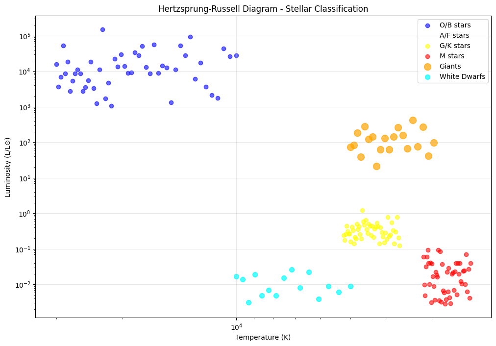

# Stellar Evolution: A Comprehensive Study

**Course:** Physics Retake Exam  
**Student Name:** [Your Name]  
**Student ID:** [Your Student ID]  
**Date:** October 26, 2023  

## 1. Introduction to Stellar Evolution

Stellar evolution is the process by which a star changes over the course of time. Depending on the mass of the star, this lifetime ranges from a few million years for the most massive to trillions of years for the least massive, which is considerably longer than the age of the universe.

## 2. Star Formation from Interstellar Clouds

### 2.1. The Birth of Stars

Stars form within relatively dense concentrations of interstellar gas and dust known as molecular clouds. These regions are extremely cold (temperatures of about 10-20K), allowing gas atoms to bond together into molecules.

**The formation process involves:**
- Gravitational collapse of dense regions within molecular clouds
- Fragmentation into smaller clumps
- Formation of protostars through accretion

### 2.2. Key Stages of Star Formation

1. **Molecular Cloud Collapse**

   The free-fall time for gravitational collapse is given by:
  # Free-Fall Time Formula

## Formula:

$$ t_{ff} = \sqrt{\frac{3\pi}{32G\rho}} $$

## Description:
This formula calculates the **time required for a gas cloud to collapse under its own gravity**. It is used in astrophysics to model star formation processes.

## Variables:

| Symbol | Description | Units |
|--------|-------------|-------|
| \( t_{ff} \) | Free-fall time | seconds (s) |
| \( G \) | Gravitational constant | \( m^3 kg^{-1} s^{-2} \) |
| \( \rho \) | Density | \( kg/m^3 \) |
| \( \pi \) | Pi constant | dimensionless |

## Constant Values:
- \( G = 6.67430 \times 10^{-11} \, m^3 kg^{-1} s^{-2} \)
- \( \pi \approx 3.14159 \)

## Example Calculation:

**For a molecular cloud:**
- Density: \( \rho = 10^{-18} \, kg/m^3 \)

**Calculation:**
$$ t_{ff} = \sqrt{\frac{3 \times 3.14159}{32 \times 6.67430 \times 10^{-11} \times 10^{-18}}} \approx 3.8 \times 10^{12} \, s \, (\approx 120,000 \, \text{years}) $$

## Physical Significance:
- Determines the timescale of star formation processes
- Used in stability analysis of gas clouds
- Helps understand the evolution of cosmic structures
- Important for modeling gravitational collapse in interstellar medium

## Applications:
- Star formation studies
- Protostellar cloud collapse models
- Galactic evolution simulations
- Cosmological structure formation

## 3. Thermonuclear Processes in Stellar Cores

### 3.1. Types of Thermonuclear Reactions

**Main sequence stars primarily use two processes:**

1. **Proton-Proton Chain** (dominant in stars < 1.5 M⊙)
2. **CNO Cycle** (dominant in stars > 1.5 M⊙)

### 3.2. Proton-Proton Chain

The proton-proton chain is the dominant energy source in stars like our Sun:

# Proton-Proton Chain Reaction - Step I

## Nuclear Reaction:

$$ 4p \rightarrow ^4He + 2e^+ + 2\nu_e + 2\gamma $$

## Description:
This equation represents the **first step of the proton-proton chain reaction**, which is the primary nuclear fusion process that powers main-sequence stars like our Sun. Four protons fuse to create one helium-4 nucleus, releasing energy in the form of positrons, neutrinos, and gamma rays.

## Particle Identification:

| Symbol | Particle | Role in Reaction |
|--------|----------|------------------|
| \( p \) | Proton | Fuel for fusion process |
| \( ^4He \) | Helium-4 nucleus | Fusion product |
| \( e^+ \) | Positron | Anti-matter particle released |
| \( \nu_e \) | Electron neutrino | Neutral lepton released |
| \( \gamma \) | Gamma ray photon | High-energy electromagnetic radiation |

## Energy Release:
- **Total energy released:** ~26.73 MeV
- **Energy distribution:**
  - Kinetic energy of helium nucleus
  - Kinetic energy of positrons
  - Energy carried by neutrinos
  - Gamma ray photons

## Detailed Process:
This overall reaction actually occurs through several intermediate steps:

1. # Proton-Proton Fusion Reaction

$$ p + p \rightarrow ^2H + e^+ + \nu_e $$

**First step of proton-proton chain reaction**  
**Weak interaction process**  
**Energy released: 1.44 MeV**  
**Deuterium production**  
**Solar neutrino source**  
**Rate-limiting step in stellar fusion**  
**Requires quantum tunneling**  
**Occurs in stellar cores**  
**Main sequence energy production**  
**Fundamental stellar process**
2. \( p + ^2H \rightarrow ^3He + \gamma \)
3. \( ^3He + ^3He \rightarrow ^4He + 2p \)

## Astrophysical Significance:
- **Primary energy source** for stars with masses similar to the Sun
- Occurs at **core temperatures** of ~10-15 million Kelvin
- Dominant fusion process in **main-sequence stars**
- Responsible for **solar energy production**
- Critical for **stellar evolution models**

## Conservation Laws Verified:
- **Mass-energy conservation:** Total energy conserved
- **Charge conservation:** 4 protons (+4e) → helium nucleus (+2e) + 2 positrons (+2e)
- **Lepton number conservation:** Properly conserved with neutrinos
- **Baryon number conservation:** 4 protons → 1 helium nucleus

## Importance in Physics:
- Key process in **nuclear astrophysics**
- Foundation of **solar neutrino studies**
- Verification of **stellar nucleosynthesis theories**
- Important for understanding **stellar lifetimes**

**Three main branches:**
- **ppI chain:** # Proton-Proton Chain Reaction - Step I

## Nuclear Reaction:

$$ p + p \rightarrow d + e^+ + \nu_e $$

## Description:
This equation represents the **first and slowest step** of the proton-proton (p-p) chain reaction, where two protons fuse to form a deuterium nucleus, releasing a positron and an electron neutrino. This is the rate-limiting step in stellar hydrogen fusion.

## Particle Identification:

| Symbol | Particle | Properties |
|--------|----------|------------|
| \( p \) | Proton | Hydrogen nucleus, charge +1e |
| \( d \) | Deuterium nucleus | \( ^2H \), contains 1 proton + 1 neutron |
| \( e^+ \) | Positron | Anti-electron, charge +1e |
| \( \nu_e \) | Electron neutrino | Neutral, low-mass lepton |

## Reaction Details:

- **Reaction type:** Weak interaction nuclear fusion
- **Energy released:** ~1.44 MeV total
- **Reaction timescale:** Extremely slow (billions of years per collision at solar core conditions)
- **Temperature requirement:** >4 million Kelvin

## Energy Distribution:
- **Deuterium kinetic energy:** ~0.14 MeV
- **Positron kinetic energy:** ~0.26 MeV
- **Neutrino energy:** ~0.26 MeV
- **Remaining energy:** Converted to gamma rays via positron-electron annihilation

## Complete Process:
$$ p + p \rightarrow d + e^+ + \nu_e + 0.42 \text{ MeV} $$
Followed by positron annihilation:
$$ e^+ + e^- \rightarrow 2\gamma + 1.02 \text{ MeV} $$

## Astrophysical Significance:

- **Rate-determining step** in solar fusion
- **Main source** of solar neutrinos
- Explains why stars have long main-sequence lifetimes
- Critical for understanding stellar energy production timescales

## Physical Challenges:
- Requires **quantum tunneling** through Coulomb barrier
- Involves **weak nuclear force** (beta decay process)
- Extremely **low cross-section**
- Explains why universe didn't instantly fuse all hydrogen

## Detection Importance:
- Solar neutrinos from this reaction provide **direct evidence** of nuclear fusion in the Sun
- Key reaction studied in **solar neutrino experiments**
- Helps verify stellar models and nuclear physics
- **ppII chain:** involves helium-3 and helium-4
- **ppIII chain:** produces helium-4 with different intermediate steps

### 3.3. CNO Cycle (Massive Stars)

For stars more massive than about 1.3 solar masses, the CNO cycle dominates:

# CNO Cycle - Carbon-Nitrogen-Oxygen Fusion

## Complete CNO Cycle Reactions:

$$ ^{12}C + p \rightarrow ^{13}N + \gamma $$
$$ ^{13}N \rightarrow ^{13}C + e^+ + \nu_e $$
$$ ^{13}C + p \rightarrow ^{14}N + \gamma $$
$$ ^{14}N + p \rightarrow ^{15}O + \gamma $$
$$ ^{15}O \rightarrow ^{15}N + e^+ + \nu_e $$
$$ ^{15}N + p \rightarrow ^{12}C + ^4He $$

## Net Reaction:
$$ 4p \rightarrow ^4He + 2e^+ + 2\nu_e + 3\gamma $$

## Cycle Description:
The CNO cycle is a hydrogen fusion process that uses carbon, nitrogen, and oxygen isotopes as catalysts to convert hydrogen into helium. This cycle dominates energy production in massive stars.

## Energy Production:
- **Total energy released per cycle:** ~26.73 MeV
- **Temperature dependence:** Strong (∝ T^20)
- **Dominant in stars:** >1.5 solar masses

## Catalytic Role:
Carbon-12 is regenerated at the end of the cycle, allowing continuous operation while consuming only protons.

## Neutrino Production:
Two electron neutrinos are released per cycle via beta-plus decays.

## Stellar Significance:
- Primary energy source for massive stars
- Requires higher temperatures than p-p chain
- Responsible for stellar nucleosynthesis
- Creates CNO isotopes in universe

## 4. Main Sequence: The Longest Stage

### 4.1. Characteristics

The main sequence is the longest stage in a star's life, where it burns hydrogen in its core. During this phase:

- Stars maintain hydrostatic equilibrium: # Hydrostatic Equilibrium Equation

$$ \frac{dP}{dr} = -\rho g $$

**Fundamental stellar structure equation**  **Pressure gradient force balances gravity**  **Spherical symmetry assumption**  
**Local gravitational acceleration**  **Mass continuity relation**  
**Stellar stability condition**  **Applies to main sequence stars**  
**White dwarf support mechanism**  **Planetary atmosphere modeling**  
**Fluid mechanics foundation**
- Energy generation balances gravitational contraction
- Position on HR diagram depends on mass
- Temperature and pressure in core sustain nuclear fusion

### 4.2. Mass-Luminosity Relation

# Mass-Luminosity Relation

$$ \frac{L}{L_\odot} \approx \left(\frac{M}{M_\odot}\right)^{3.5} $$

**Main sequence stars relation**  **Empirical power law scaling**  
**Steep mass dependence**  **Nuclear fusion rate correlation**  
**Stellar lifetime determination**  **Exponent varies with mass range**  
**Core temperature scaling**  **Pressure-temperature relation**  
**Observational Hertzsprung-Russell fit**  **Stellar evolution modeling**

Where:
- \(L\) is luminosity
- \(M\) is mass
- \(\odot\) denotes solar values

### 4.3. Main Sequence Lifetime

`\[
\tau_{MS} \approx 10^{10} \text{ years} \times \left(\frac{M}{M_\odot}\right)^{-2.5}
\]`

## 5. Evolution of Low-Mass Stars (M < 8M⊙)

### 5.1. Red Giant Phase

After hydrogen exhaustion in the core:
- Shell hydrogen burning begins
- Star expands dramatically (100-1000× solar radius)
- Surface temperature decreases
- Luminosity increases significantly

### 5.2. Helium Flash and Horizontal Branch

For stars ~0.8-2.0 M⊙:
- Degenerate helium core ignites explosively
- Star settles on horizontal branch
- Helium burning in core, hydrogen burning in shell

### 5.3. Planetary Nebula and White Dwarf Formation

**Final stages:**
- Thermal pulses and mass loss
- Planetary nebula ejection
- White dwarf remnant

**White dwarf mass-radius relation:**
`\[
R \propto M^{-1/3}
\]`

## 6. Evolution of High-Mass Stars (M > 8M⊙)

### 6.1. Supergiant Phase

Massive stars evolve rapidly through multiple burning stages:

| Burning Stage | Duration | Core Temperature | Main Products |
|---------------|----------|------------------|---------------|
| Hydrogen      | ~10⁷ years | 15×10⁶ K       | He            |
| Helium        | ~10⁶ years | 100×10⁶ K      | C, O          |
| Carbon        | ~10³ years | 600×10⁶ K      | Ne, Na, Mg    |
| Neon          | ~1 year   | 1.2×10⁹ K      | O, Mg         |
| Oxygen        | ~months   | 1.5×10⁹ K      | Si, S         |
| Silicon       | ~days     | 2.7×10⁹ K      | Fe            |

### 6.2. Supernova Explosions

**Core collapse supernova mechanism:**
- Iron core grows to Chandrasekhar limit (~1.4 M⊙)
- Electron degeneracy pressure fails
- Core collapses at ~25% speed of light
- Shock wave propagates outward

**Energy released:**
`\[
E_{SN} \approx 10^{46} \text{ J} \approx 10^{53} \text{ erg}
\]`

## 7. Importance of Supernovae for Element Distribution

### 7.1. Nucleosynthesis Processes

**Two main processes in supernovae:**

1. **Explosive nucleosynthesis:** Elements up to iron formed through fusion
2. **r-process (rapid neutron capture):** Heavy elements beyond iron formed by neutron capture

### 7.2. Cosmic Abundance Patterns

Supernovae are primary sources for:
- **Alpha elements:** Oxygen, magnesium, silicon, sulfur, calcium
- **Iron peak elements:** Iron, nickel, cobalt
- **Heavy elements:** Gold, uranium, platinum via r-process

## 8. Types of Stellar Remnants

### 8.1. White Dwarfs

**Properties:**
- Mass: 0.6-1.4 M⊙
- Radius: ~Earth size (∼6,400 km)
- Density: ~10⁶ g/cm³
- Supported by electron degeneracy pressure

**Chandrasekhar limit:**
`\[
M_{Ch} \approx 1.4 M_\odot
\]`

### 8.2. Neutron Stars

**Properties:**
- Mass: 1.4-3 M⊙
- Radius: ~10 km
- Density: ~10¹⁴ g/cm³ (nuclear density)
- Supported by neutron degeneracy pressure
- Rapid rotation (millisecond periods)
- Strong magnetic fields (10⁸-10¹⁵ Gauss)

### 8.3. Black Holes

**Form when remnant mass exceeds Tolman-Oppenheimer-Volkoff limit (~3 M⊙)**

**Schwarzschild radius:**
`\[
R_s = \frac{2GM}{c^2}
\]`

Where:
- \(G\) is gravitational constant
- \(M\) is mass
- \(c\) is speed of light

## 9. Hertzsprung-Russell Diagram for Stellar Classification

### 9.1. HR Diagram Components

