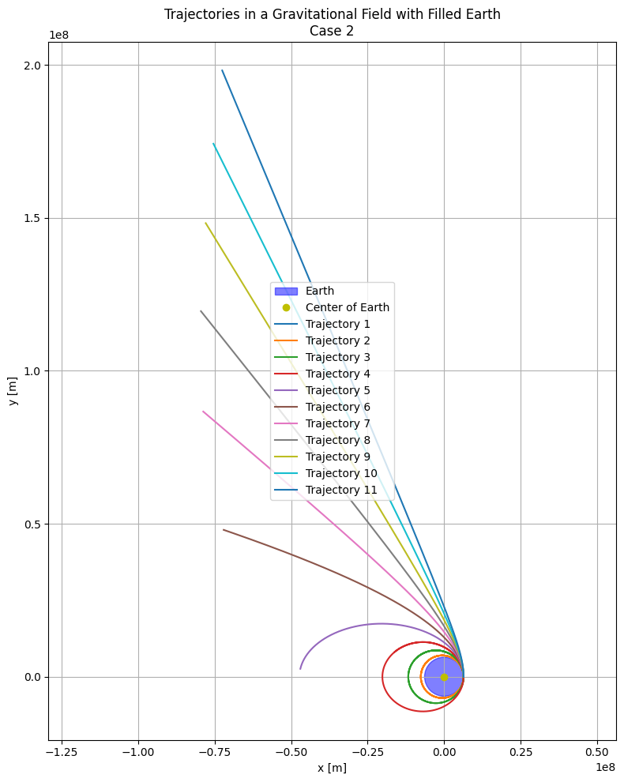

# Problem 3  

## Payload Trajectories Near Earth  

When a payload is let go from a rocket traveling near Earth, its path is shaped by the **initial speed** it has and **Earth’s gravity**. These paths take the form of **conic sections**, and the type of trajectory depends on the object’s **total mechanical energy**.

---

## Overview of Orbital Paths

| Path Type      | Condition (Total Energy)            | Behavior                                 |
|----------------|-------------------------------------|------------------------------------------|
| **Ellipse**    | $E < 0$                              | Closed orbit — payload stays bound to Earth |
| **Parabola**   | $E = 0$                              | Edge case — just escapes Earth’s gravity |
| **Hyperbola**  | $E > 0$                              | Escape route — payload leaves permanently |

---

## Total Energy Equation

$$
E = \frac{1}{2}mv^2 - \frac{GMm}{r}
$$

Where:  
- $m$ = payload mass  
- $v$ = velocity at release  
- $G$ = universal gravitational constant  
- $M$ = Earth's mass  
- $r$ = distance from Earth’s center  

---

## 1. Elliptical Path

- **Condition**: $v < v_{esc}$  
- **Shape**: Closed orbital motion  
- **Example**: Satellites in Earth orbit  

---

## 2. Parabolic Path

- **Condition**: $v = v_{esc} = \sqrt{\frac{2GM}{r}}$  
- **Shape**: Open path with zero excess energy  
- **Example**: Rare theoretical boundary case  

---

## 3. Hyperbolic Path

- **Condition**: $v > v_{esc}$  
- **Shape**: Open curve leading away from Earth  
- **Example**: Probes headed for deep space  

---

## 4. Suborbital Trajectory

- **Condition**: Released with insufficient horizontal speed, near atmosphere  
- **Shape**: Arcing path that falls back to Earth  
- **Example**: Missiles, test vehicles, and reentry modules  

---

## Recap

- **Elliptical**: Object remains in Earth orbit.  
- **Parabolic**: Reaches escape speed with no surplus energy.  
- **Hyperbolic**: Surpasses escape speed, permanently departing.  
- **Suborbital**: Lacks energy for orbit, falls back.

---

## Numerical Modeling: Simulating Payload Motion

### Gravitational Force

The motion of a freely released payload is controlled by gravitational attraction, expressed by Newton’s universal gravitation law:

$$
F = -\frac{G M m}{r^2} \hat{r}
$$

Where:  
- $G = 6.674 \times 10^{-11} \, \text{m}^3 \, \text{kg}^{-1} \, \text{s}^{-2}$  
- $M = 5.972 \times 10^{24} \, \text{kg}$  
- $r$: Distance from Earth’s center  
- $\hat{r}$: Unit vector from Earth to payload  

Via Newton’s Second Law, $F = ma$, we derive:

$$
\frac{d^2 r}{dt^2} = -\frac{G M r}{r^3}
$$

---

### Solving with Runge-Kutta (RK4)

To compute the trajectory numerically, we use the **Runge-Kutta 4th order method**. This transforms the second-order ODE into a first-order system:

$$
\frac{d r}{dt} = v, \quad \frac{d v}{dt} = -\frac{G M r}{r^3}
$$

### Initial Setup

- **Starting Point**: Payload begins 500 km above Earth’s surface, so $r_0 = R_{\text{Earth}} + 500\,\text{km}$  
- **Initial Speed**: Varies depending on the mission goal (orbit, escape, or suborbital arc)

---

## Applications of Trajectories

### 1. **Achieving Orbit (Elliptical or Circular)**

- **How**: Released with enough tangential velocity to counter gravity  
- **Outcome**: Remains in a closed orbit  
- **Requirement**: $v < v_{esc}$ and $E < 0$  
- **Examples**: Satellites, space stations  

**Typical Case**:  
$$v_{\text{orbit}} = \sqrt{\frac{GM}{r}} \approx 7.7 \, \text{km/s (at 300 km altitude)}$$

---

### 2. **Reentry (Suborbital or Decaying Orbit)**

- **How**: Released with inadequate velocity or affected by drag  
- **Outcome**: Falls back to Earth  
- **Example**: Test capsules, missiles  

**Visual**: Steep arc that reenters the atmosphere, like a downward parabola

---

### 3. **Escape (Hyperbolic Path)**

- **How**: Achieves or exceeds escape velocity  
- **Outcome**: Leaves Earth’s gravity permanently  
- **Requirement**: $v \geq \sqrt{\frac{2GM}{r}}$ and $E \geq 0$  
- **Examples**: Voyager, interplanetary missions  

**At Sea Level**:  
$$v_{\text{esc}} \approx 11.2 \, \text{km/s}$$

---

## Comparative Scenarios

| Condition         | Trajectory Type         | Speed Range       | Purpose                          |
|------------------|--------------------------|--------------------|----------------------------------|
| Orbital Insertion | Elliptical or Circular   | ~7.7 km/s          | Earth satellites, ISS            |
| Reentry           | Suborbital               | < 7.7 km/s         | Capsules, suborbital flights     |
| Escape            | Hyperbolic               | > 11.2 km/s        | Interplanetary or interstellar   |

---

## Visuals

- **1st Cosmic Velocity** → stable circular orbit  
- **2nd Cosmic Velocity** → parabolic escape  
- **3rd Cosmic Velocity** → hyperbolic path beyond Earth and Sun  

---

## Motion in Uniform Density Earth — Case 1

Objec%20Trajectories.png)

Assuming Earth is a filled sphere with constant density, this simulation plots trajectories under a **uniform gravitational field**.

- **Orbits 1–4**: Bound paths (elliptical/circular)  
- **Path 5**: A high arc; object almost escapes  
- **Path 6**: Escape trajectory — object exits gravity well  

---

### Alternate Setup — Case 2

