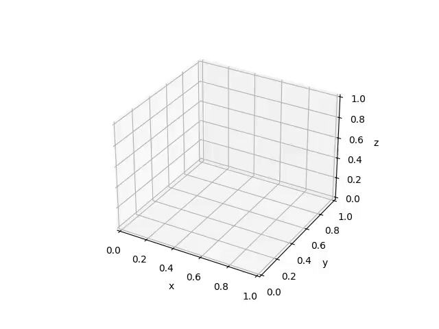
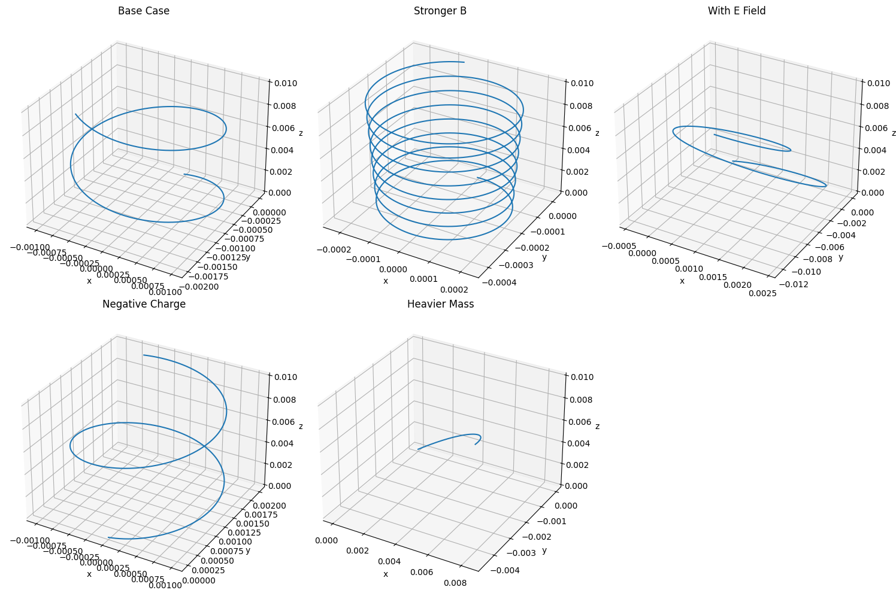

# Problem 1

## **1. Systems Dependent on the Lorentz Force**

Below are several essential systems and technologies that fundamentally rely on the Lorentz force:

---

### **A. High-Energy Particle Accelerators**

- **Functionality**: Electrically charged particles (e.g., electrons, protons) are energized via electric fields and maneuvered using magnetic fields.
- **Lorentz Force Influence**:
  - $\vec{F} = q\vec{E}$: Electric fields impart energy, speeding up particles.
  - $\vec{F} = q\vec{v} \times \vec{B}$: Magnetic fields bend their paths into arcs or spirals.
- **Example**: The Large Hadron Collider (LHC) utilizes intense magnetic fields to direct proton beams moving close to the speed of light.

---

### **B. Mass-to-Charge Analyzers (Mass Spectrometry)**

- **Purpose**: Differentiate ions based on their ratio of mass to charge.
- **Lorentz Force Application**:
  - Ions traverse through electromagnetic fields and are deflected according to their motion and charge.
  - The arc radius provides insight into their mass.
- **Principal Formula**: 
  $$
  r = \frac{mv}{qB}
  $$
- **Use Case**: Chemical analysis and isotope identification.

---

### **C. Magnetic Plasma Confinement (e.g., Tokamak Reactors)**

- **Operation**: Magnetic fields constrain high-temperature plasma in fusion devices.
- **Lorentz Force Function**:
  - Magnetic fields restrict ionized gas motion into a toroidal (doughnut-like) loop, preventing energy loss to reactor walls.
- **Relevance**: Essential for sustaining nuclear fusion conditions.

---

### **D. Electron Beam Tubes (Cathode Ray Tubes)**

- **Mechanism**: Electron streams are directed by electromagnetic fields to create images.
- **Lorentz Force Dynamics**:
  - Electric fields accelerate electrons.
  - Magnetic fields adjust their trajectory across the screen.

---

### **E. Cosmic Phenomena (e.g., Solar Wind & Magnetic Fields)**

- **Description**: Solar particles interact with planetary magnetic shields, like Earth’s magnetosphere.
- **Lorentz Force Role**:
  - Dictates the paths of solar particles and cosmic radiation.
  - Explains atmospheric effects such as auroras and space weather disruptions.

---

## **2. Roles of Electric ($\vec{E}$) and Magnetic ($\vec{B}$) Fields**

---

### **Electric Fields ($\vec{E}$)**

- **Primary Effect**: Accelerate charged particles, increasing their speed along the field direction.
- **Linear Influence**: Changes velocity without necessarily curving the path (in uniform regions).
- **Applications**:
  - Initiating movement from rest.
  - Injecting energy into particles.

---

### **Magnetic Fields ($\vec{B}$)**

- **Steering Function**: Alter particle direction but not speed.
- **Induces Circular Motion**: The magnetic component of Lorentz force is perpendicular to particle motion.
- **Used for**:
  - Directing and focusing charged beams (e.g., accelerators, analyzers).
  - Retaining plasma within fusion devices.

### Animation: Charged Particle Path in a Magnetic Field

---

### **Combined Field Effects**

The complete Lorentz force expression:

$$
\vec{F} = q\vec{E} + q\vec{v} \times \vec{B}
$$

Leads to complex particle motion:

- **Field-Induced Drift**: In perpendicular $\vec{E}$ and $\vec{B}$ fields, a sideways drift emerges.
- **Cyclotron Dynamics**: Circular orbiting in pure magnetic fields.
- **Helix Formation**: Spiral trajectories along field lines in combined environments.

---

## **Parameter Sensitivity Study**

### **Lorentz Force Equation**

$$
\vec{F} = q (\vec{E} + \vec{v} \times \vec{B})
$$

Where:
- $q$ = particle charge
- $m$ = particle mass
- $\vec{E}$ = electric field
- $\vec{B}$ = magnetic field
- $\vec{v}$ = velocity vector

---

### **1. Field Magnitudes: $\vec{E}$ and $\vec{B}$**

- **Electric Field ($\vec{E}$)**:
  - Causes straight-line acceleration: 
    $$
    \vec{a}_E = \frac{q\vec{E}}{m}
    $$
  - Drives linear increase in particle velocity.

- **Magnetic Field ($\vec{B}$)**:
  - Produces curved or spiral paths.
  - Circular path radius: 
    $$
    r = \frac{mv}{|q||\vec{B}|}
    $$
  - Orbit frequency (cyclotron): 
    $$
    f = \frac{|q||\vec{B}|}{2\pi m}
    $$

> **Effects**:
- Boosting $B$ tightens particle orbits and increases frequency.
- Increasing $E$ stretches trajectories in the electric field’s direction.

---

### **2. Velocity Vector $\vec{v}$**

- $\vec{v} \parallel \vec{B}$: Motion continues linearly along magnetic lines.
- $\vec{v} \perp \vec{B}$: Creates circular orbits.
- Combined directions: Produce **helical paths**.

> **Observation**: Changing the direction of velocity alters the trajectory shape — from straight to circular to spiral.

---

### **3. Particle Charge $q$ and Mass $m$**

- **Charge $q$**:
  - Determines force direction (positive/negative).
  - Larger $|q|$ increases force.

- **Mass $m$**:
  - Heavier particles accelerate more slowly and move in broader circles.
  - Lighter particles respond faster to fields.

> **Insight**:
- Charge sign dictates rotation direction.
- Mass affects orbit size and acceleration sensitivity.

---

### Simulated Paths: Effects of Field Intensity, Charge, Mass, and Initial Speed

---

## **Key Phenomena: Larmor Radius and Drift Motion**

### **Larmor Radius (Cyclotron Radius)**

Describes the radius of circular motion when a charged particle moves perpendicular to a magnetic field.

**Formula**:

$$
r_L = \frac{mv}{|q|B}
$$

Where:
- $m$ = particle mass
- $v$ = velocity component orthogonal to $\vec{B}$
- $q$ = particle charge
- $B$ = magnetic intensity

**Interpretation**:
- Stronger $B$ → tighter loops.
- Larger $m$ or $v$ → broader orbits.
- Defines scale of rotational motion in a magnetic environment.

---

### **Drift Speed (Velocity)**

When both $\vec{E}$ and $\vec{B}$ fields are present, particles exhibit a **net drift** aside from their rotational path.

**Equation**:

$$
\vec{v}_D = \frac{\vec{E}}{B}
$$

Where:
- $\vec{E}$ = electric field
- $B$ = magnetic field magnitude

**Explanation**:
- Drift speed is perpendicular to $\vec{B}$ and in the direction of $\vec{E}$.
- In a cross-field layout, the path spirals while drifting due to the electric field.

---

## **Connecting Larmor Radius and Drift Speed**

- The **Larmor radius** characterizes the looped motion in a magnetic field.
- **Drift velocity** describes the particle’s overall travel due to the presence of an electric field.
- Combined, these result in a helical path that drifts across field lines.

---

## **Summary: Understanding the Lorentz Force**

The Lorentz force governs the dynamics of electrically charged particles in combined electric and magnetic fields, with broad relevance in science and engineering. Electric fields linearly boost particle speeds, while magnetic fields guide their paths without speed changes. These behaviors underpin essential technologies like particle accelerators, spectrometry tools, fusion reactors, and old display systems, and also help us interpret cosmic activity.

By examining how particle mass, charge, speed, and field intensity affect behavior, we gain predictive power over their movement. The Larmor radius reveals the size of rotational motion, while drift speed highlights net transport. This understanding enables accurate manipulation of charged particles in both experimental and practical systems.
