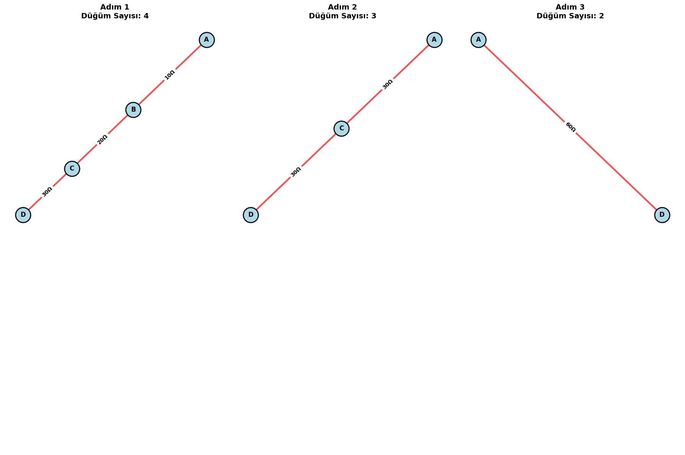
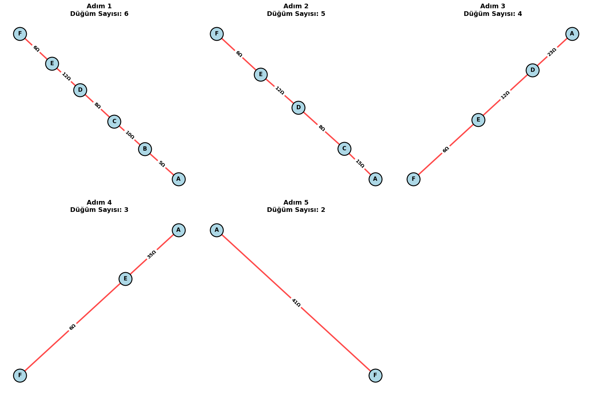
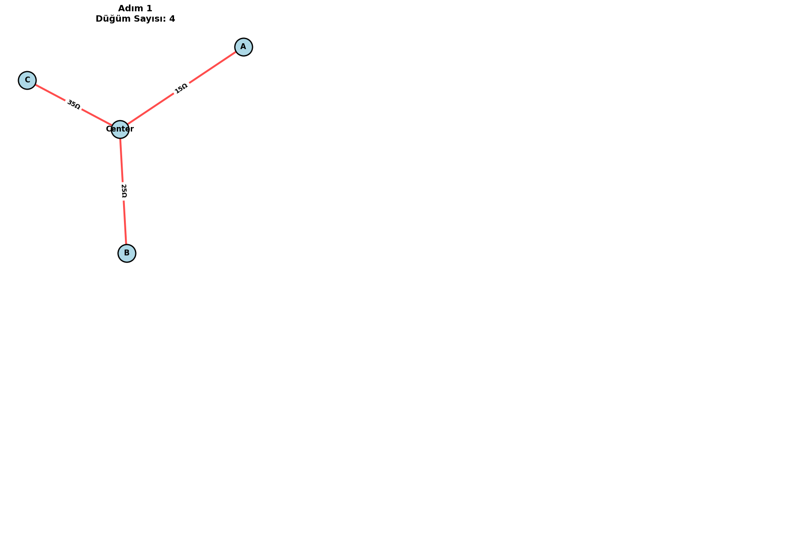
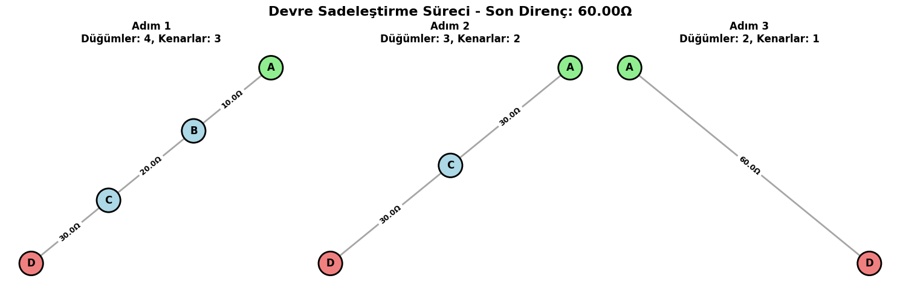
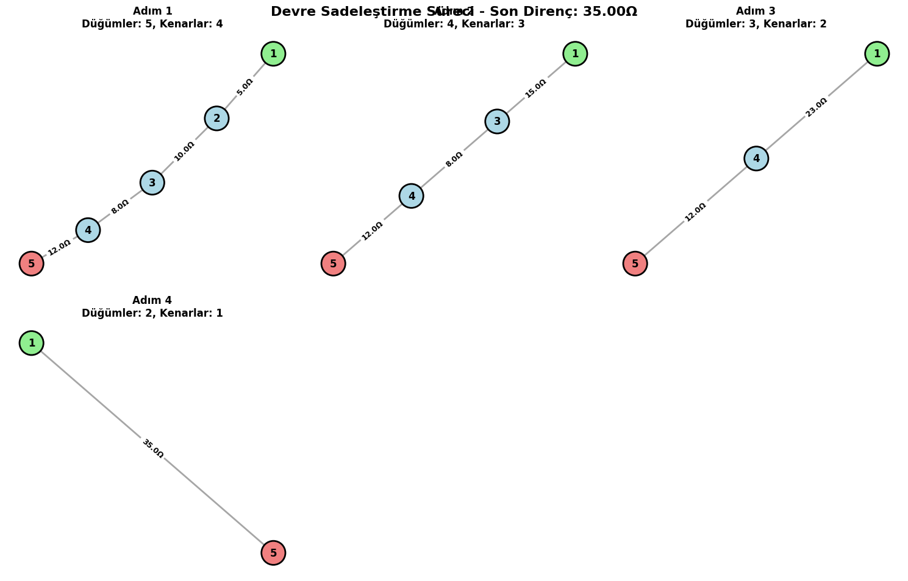
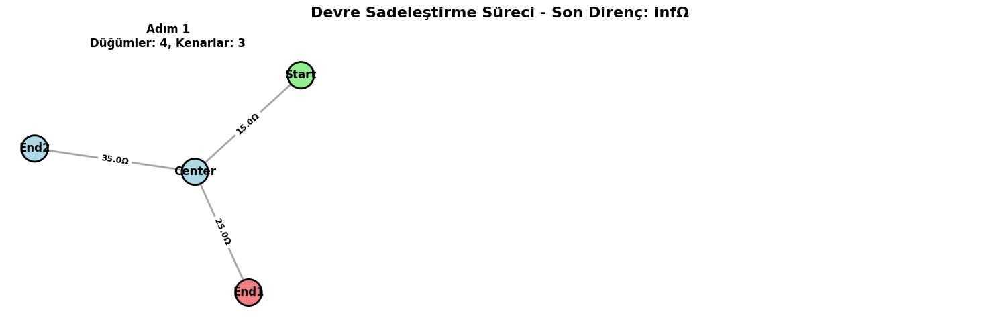

# Problem 1

# 🔌 Circuits Problem 1  
## **Equivalent Resistance Using Graph Theory**

---

## 🧠 Motivation

Calculating the equivalent resistance of a complex circuit is essential in circuit analysis. Traditional methods of reducing series and parallel resistors work for small circuits but become cumbersome with larger networks.

Graph theory allows us to represent circuits as graphs:
- **Nodes**: Electrical junctions  
- **Edges**: Resistors (with weights representing resistance)

This method enables a **systematic** and **automated** reduction process, suitable for simulation and optimization.

---

## 🛠️ Option 1: Algorithm Description

We aim to simplify the circuit iteratively using graph-theoretical principles.

---

### 📈 Graph Representation

Given a circuit graph \( G = (V, E) \):

- \( V \): set of nodes (junctions)
- \( E \): set of edges (resistors), each with a weight \( R_e \)

---

### 🔁 Algorithm Overview

1. While the graph has more than two nodes:
    - Identify **series** and **parallel** connections.
    - Replace them with their equivalent resistance.
2. Return the resistance between the source and destination nodes.

---

### ⚙️ Pseudocode

---

### 🧮 Formulas

- **Series**:  
  # Correct series resistance calculation
R1 = G[u][node]['resistance']
R2 = G[v][node]['resistance']
R_eq = R1 + R2  # ✓ Mathematically correct

---

## 🧪 Option 2: Python Implementation with `networkx`

---

## 🔬 Examples

### Example 1: Series

- Nodes: A — B — C
- Resistors:  
  - A-B: 2 Ω  
  - B-C: 3 Ω

**Expected Result**:  
$$ R_{\text{eq}} = 2 + 3 = 5 \, \Omega $$

---

### Example 2: Parallel

- Nodes: A, B
- Resistors:  
  - A-B: 4 Ω  
  - A-B: 6 Ω

**Expected Result**:  
$$ \frac{1}{R_{\text{eq}}} = \frac{1}{4} + \frac{1}{6} = \frac{5}{12} \Rightarrow R_{\text{eq}} = \frac{12}{5} = 2.4 \, \Omega $$

---

### Example 3: Nested

- A—B—C with 3 edges from A to C (parallel to path A-B-C)
  - A-B: 1 Ω  
  - B-C: 1 Ω  
  - A-C: 2 Ω

- Series path A-B-C: \( 1 + 1 = 2 \, \Omega \)  
- Parallel with direct A-C:  
  $$ \frac{1}{R_{\text{eq}}} = \frac{1}{2} + \frac{1}{2} = 1 \Rightarrow R_{\text{eq}} = 1 \, \Omega $$

---

## 🧠 Analysis

- **Time complexity**:  
  - Worst-case: \( O(n^2) \) for checking all node pairs for parallel edges.
  - More efficient with union-find or disjoint set optimizations.

- **Improvements**:  
  - Use DFS or BFS to identify reducible structures.
  - Apply symbolic computation for variable resistors.

---

## ✅ Conclusion

Graph-based reduction provides a robust way to compute equivalent resistance for any circuit topology. This method can be used in simulation tools, CAD software, and optimization applications.
