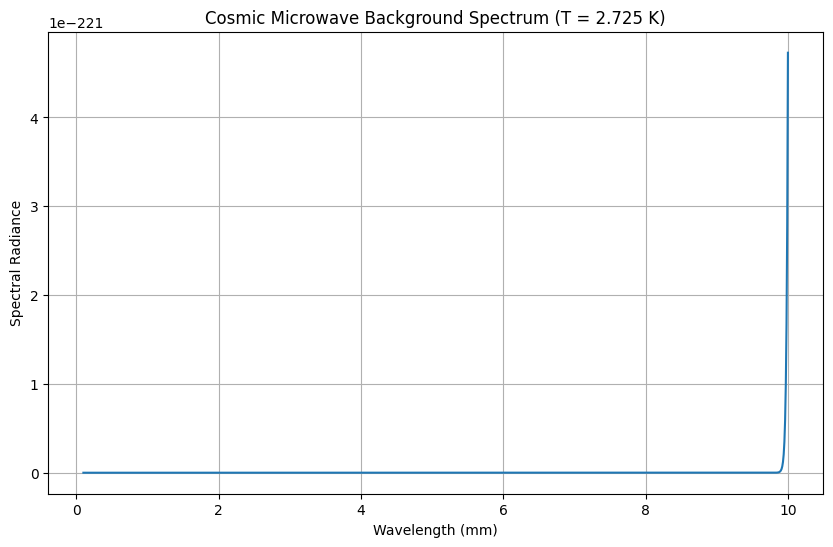

# The Big Bang Theory: A Comprehensive Overview

## 1. Main Postulates of the Big Bang Theory

### Fundamental Principles
- **Universe Expansion**: The universe is continuously expanding from an initial hot, dense state
- **Cosmic Evolution**: The universe has evolved from a singularity approximately 13.8 billion years ago
- **Homogeneity and Isotropy**: On large scales, the universe appears uniform in all directions (Cosmological Principle)

### Key Mathematical Foundations
- **Friedmann Equations**: Derived from Einstein's field equations of general relativity
  $$
  H^2 = \left(\frac{\dot{a}}{a}\right)^2 = \frac{8\pi G}{3}\rho - \frac{kc^2}{a^2} + \frac{\Lambda c^2}{3}
  $$
- **Scale Factor**: $a(t)$ describes the relative expansion of the universe
- **Hubble Parameter**: $H(t) = \dot{a}/a$ quantifies the expansion rate

## 2. Initial Phases of the Universe

### Planck Epoch (0 to 10⁻⁴³ seconds)
- Temperature: ~10³² K
- All fundamental forces unified
- Quantum gravity effects dominate

### Grand Unification Epoch (10⁻⁴³ to 10⁻³⁶ seconds)
- Strong nuclear force separates from electroweak force
- Possible inflation trigger

### Inflationary Epoch (10⁻³⁶ to 10⁻³² seconds)
- **Rapid Exponential Expansion**: Universe expands by factor of ~10²⁶
- **Horizon Problem Solution**: Explains uniform CMB temperature
- **Flatness Problem Resolution**: Predicts nearly flat universe geometry

### Primordial Nucleosynthesis (3 minutes to 20 minutes)
- **Deuterium Formation**: First stable atomic nuclei
- **Light Element Production**:
  - Hydrogen-1 (75% by mass)
  - Helium-4 (25% by mass)
  - Trace amounts of deuterium, helium-3, lithium-7

**Nuclear Reactions during Nucleosynthesis**:
$$
p + n \rightarrow D + \gamma
$$
$$
D + D \rightarrow ^3He + n
$$
$$
D + D \rightarrow T + p
$$

## 3. Main Evidence for the Theory

### Cosmic Microwave Background Radiation (CMB)

#### Discovery and Properties
- **Accidental Discovery**: 1965 by Penzias and Wilson
- **Blackbody Spectrum**: Perfect thermal spectrum at 2.725 K
- **Isotropy**: Uniform to 1 part in 100,000
- **Anisotropies**: Tiny fluctuations reveal density variations

#### CMB Key Measurements

# Generate CMB spectrum
